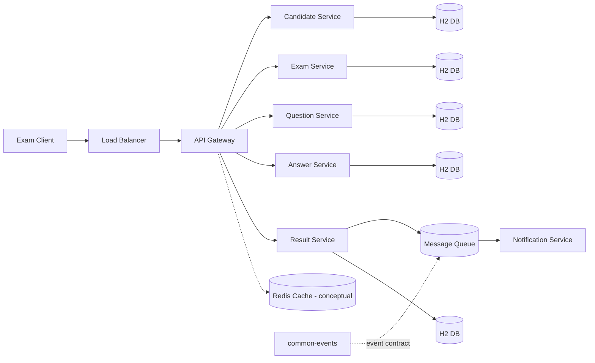

# Round 3 Architecture

```mermaid
flowchart LR
 Client[Exam Client] --> LB[Load Balancer] --> Gateway[API Gateway]
 Gateway --> Candidate[Candidate Service] & Exam[Exam Service] & Question[Question Service] & Answer[Answer Service] & Result[Result Service]
 Result --> Queue[(Message Queue)] --> Notification[Notification Service]
 Candidate --> DB1[(H2 DB)]
 Exam --> DB2[(H2 DB)]
 Question --> DB3[(H2 DB)]
 Answer --> DB4[(H2 DB)]
 Result --> DB5[(H2 DB)]
 Gateway -.-> Cache[(Redis Cache - conceptual)]
 Events[common-events] -. event contract .-> Queue
```
